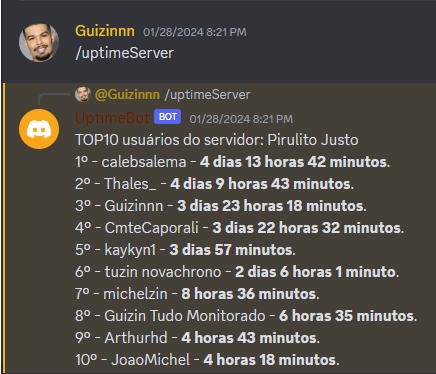
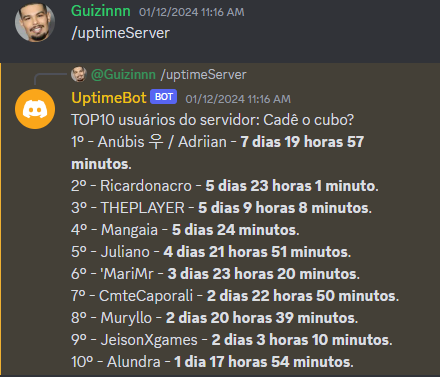
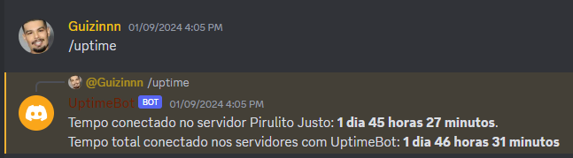
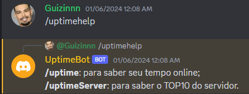

# UptimeBot

UptimeBot is a Discord bot designed to measure users' online time in servers.

## How It Works

Every time you enter a voice channel, the bot creates a record with the date and time. When you leave the channel, it calculates the difference between the entered and left times and saves the duration.
To maintain near real-time accuracy, a cron job runs every 5 minutes, updating all online users who are currently in voice channels.

## Purpose and Development

This bot was created by  [@me](https://github.com/GuilhermeSAraujo)  as a learning tool to enhance my understanding of backend applications using Node.js with TypeScript, MongoDB (v1 was initially created on Mongo, then migrated to Postgres), Dockerization, AWS EC2, and more.

## Hosting and Feedback

The bot was hosted on the AWS EC2 console for approximately two months across eight different servers. During this period, user feedback was crucial in assessing the consistency of the time tracking feature.

Use cases of the commands:

TOP10 users command | TOP10 users command
:-------------------------:|:-------------------------:
  |  
All uptime from user | Help command
  |  

## Acknowledgments

Thanks to Discord's robust API, developing this bot and learning about these topics was made possible.
